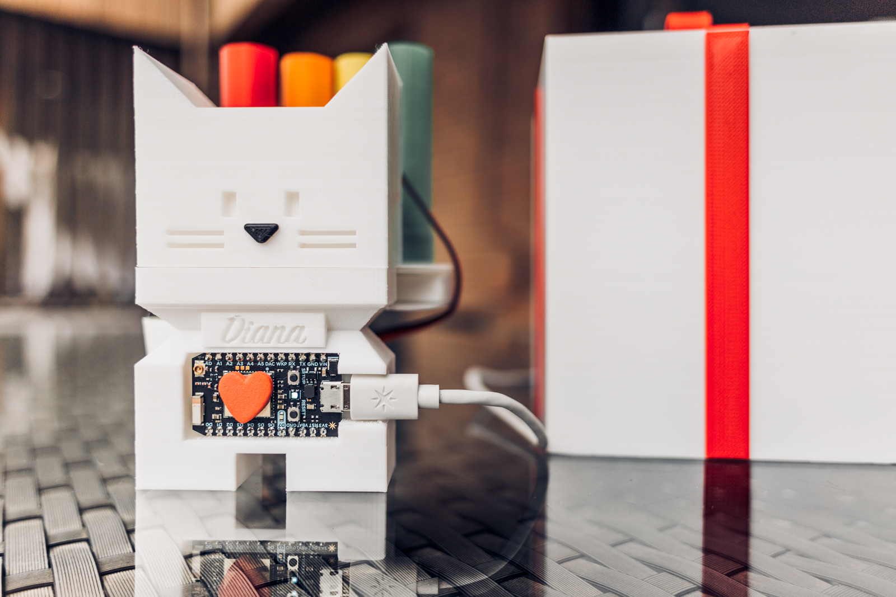

# Internet connected pill dispenser

## Revisions

### Mark I

Done during [BattleHack Warsaw](https://2014.battlehack.org/warsaw/) hackathon (got 2nd place).

TODO: Mention bitbeam

### Mark II

Revised version made for CNBC Cloud Challenge show. Improvements include less parts requiring glue and built in studs for servos. Device also contains a screen and a button.

### Mark III aka "Gato"

Custom build as a gift. Stylized to look as a cat and comes with [it's own webapp](Gato).
